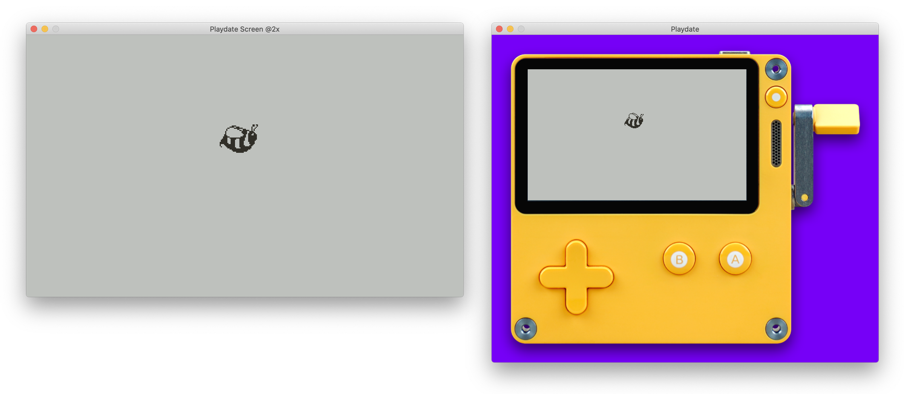

# Playdate SDK Now Available!
The official [Playdate SDK](https://play.date/dev/) is now publicly available. 

👆 **Use that instead of this**. 👆

This project is no longer active and will be archived.

  
## love-playdate-emulation

A basic template for previewing games built with [LÖVE](https://love2d.org) in a [Playdate](https://play.date)-like environment.

This template creates an environment for running LÖVE games in a way that resembles how they might appear on the upcoming Playdate console. It creates a [Canvas](https://love2d.org/wiki/Canvas) on which to build your game, already set up as a 400x240 1-bit aliased grayscale environment. The Canvas runs a shader that converts all images to grey-on-grey. This way you can prepare black and white images for an actual Playdate game, and have them display here similar to how they might appear on device.

When running your game, choose to view it as a 1x or 2x Playdate-sized screen, or in context of the console itself.

⚠️ **This is an unofficial project, for experimentation only.**  
This is not an actual Playdate emulator or simulator. I have no access to the actual Playdate SDK. Games made with this template will **not** run on the device when it's released. 

## Getting Started

### Requirements
1. [LÖVE](https://love2d.org)

### Setup
Clone this repo, and start building your game in the `game.lua` file.

This file has `loadGame`, `updateGame`, and `drawGame` functions that corresond to LÖVE's `load`, `update`, and `draw`.

### Usage
Your game should be built in the `game.lua` file. `main.lua` handles the basic setup and wraps your game in the simulated Playdate environment. `playdate-env.lua` contains the code for emulating the Playdate screen.

When running your game, press keys `1` through `4` to view the screen display at 1x, 2x, 3x or 4x scale.  
Press `d` to toggle the device image.  
Press `Shift-D` to toggle scaling on the device image.

## License
This project is licensed under the Unlicense - see the [LICENSE](LICENSE) file for details.

All Playdate imagery and trademarks are property of [Panic, Inc](https://panic.com). No copyright intended 😬.

